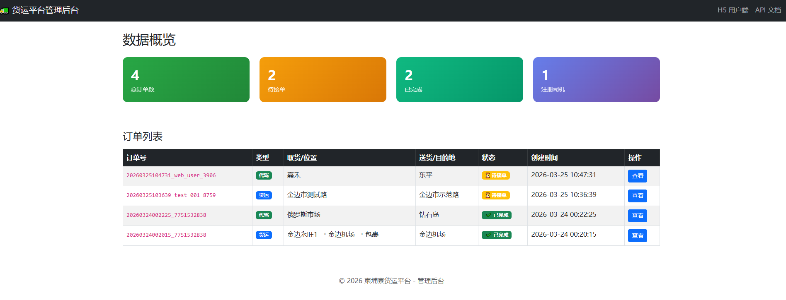
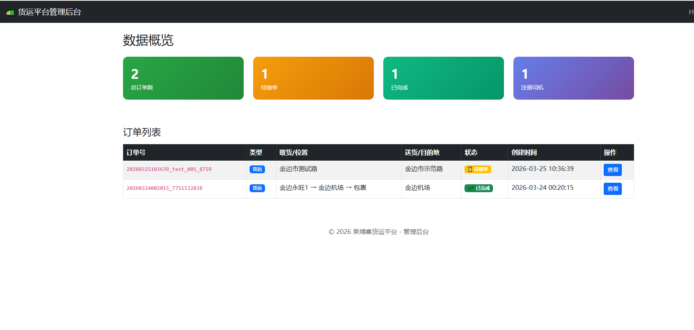
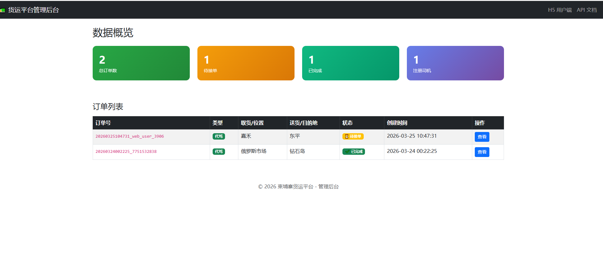

# 货运+代驾双平台系统

基于 Telegram Bot 的货运与代驾平台，支持用户下单、司机接单、管理后台。

## 📍 当前状态

✅ **已上线运行** - 服务于真实司机和用户，稳定运行中

## 🚀 功能特点

### 用户端（Telegram Bot）
- 货运下单：输入取货/送货地址，自动计算价格
- 代驾下单：输入当前位置/目的地，自动计算价格
- 订单状态查询
- 确认完成订单

### 司机端（Telegram Bot）
- 司机注册（姓名、电话、车型/驾龄）
- 查看待接订单
- 抢单/接单
- 查看已接订单
- 提现申请

### 管理后台（Web）
- 订单列表展示（支持货运/代驾分类）
- 统计卡片（总订单、待接单、已完成）
- 订单详情查看
- CSV 数据导出
- 订单状态修改

## 🛠️ 技术栈

| 层级 | 技术 |
|------|------|
| 后端 | Python / Flask |
| Bot框架 | python-telegram-bot v20（异步处理高并发）|
| 地图API | Google Maps API |
| 前端 | Bootstrap 5 |
| 部署 | 阿里云轻量服务器（美国弗吉尼亚）|

## 💡 技术亮点

- **异步高并发**：利用 python-telegram-bot v20 的异步特性，支持多用户同时下单
- **快速后台**：通过 Flask 轻量级架构，管理后台响应迅速
- **自动计价**：基于 Google Maps API 的距离计算，实时生成运费/代驾费
- **数据导出**：支持 CSV 格式订单导出，方便财务对账

## 🔗 体验链接

| 服务 | 链接 |
|------|------|
| 货运Bot | https://t.me/YunjieFreightBot |
| 代驾Bot | https://t.me/AntuDriveBot |
| 管理后台 |（演示地址）               |

> 演示账号：联系获取

## 📸 功能截图

### 管理后台 - 全部订单


### 货运订单页面


### 代驾订单页面


## 🔧 本地运行

```bash
git clone https://github.com/chen-dongfang1/freight-platform.git
cd freight-platform
pip install -r requirements.txt
python app.py
